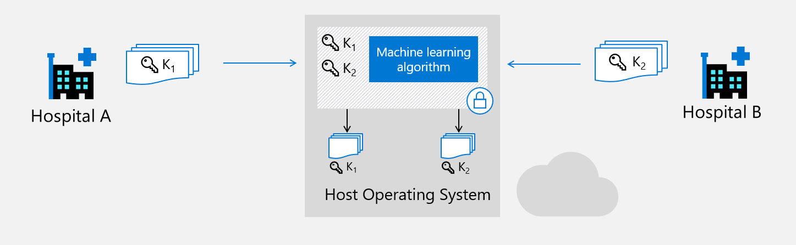
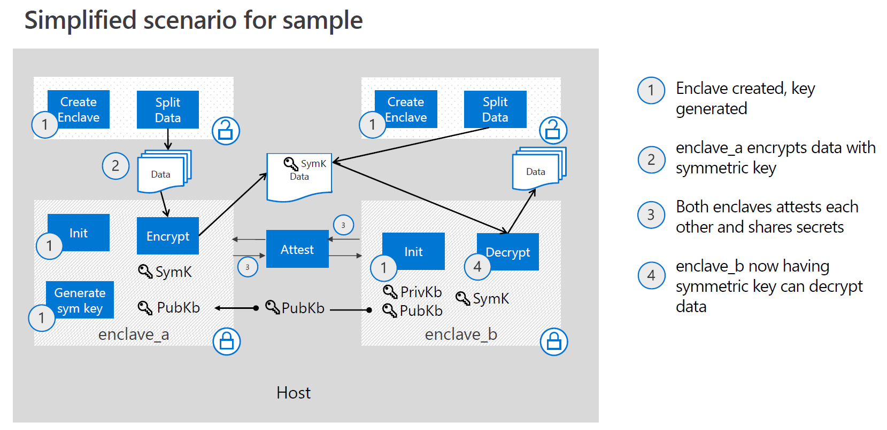

# The Secret Sharing Samples

This sample demonstrates how to do remote attestation between two enclaves and establish a secure communication channel for exchanging secret (AES key) between them.

It has the following properties:

- Written in C++
- Demonstrates an implementation of remote attestation
- Use of mbedTLS within the enclave
- Use Remote Attestaion (with Asymmetric / Public-Key Encryption) to establish secure communications between two attesting enclaves
- Generate a symmetric key, share it to the other enclave securely
- Encryption from one enclave and decryption from an other
- Enclave APIs used (in common/attestation.cpp):
  - oe_get_report
  - oe_verify_report

**Note: Currently those sample only works on SGX-FLC systems.** The underlying SGX library support for end-to-end remote attestation is available only on SGX-FLC system (Flexible Launch Control, learn more [here](https://software.intel.com/en-us/blogs/2018/12/09/an-update-on-3rd-party-attestation)). There is no plan to back port those libraries to either SGX1 system or software emulator.

## Attestation primer

### What is Attestation

Please see the [OE Remote Attestation sample](https://github.com/openenclave/openenclave/blob/master/samples/remote_attestation/README.md) for more information on attestation.

Essentially, successfully attested enclave proves:

- The enclave is running in a valid Trusted Execution Environment (TEE), which is Intel SGX in this case (trustworthiness).

- The enclave has the correct identity and runtime properties that has not been tampered with (identity).

### Secure Communication Channel

In this sample we only generate a symmetric key in the enclave_a, encrypt it with the public key of enclave_b and then send it through network to enclave_b. This will ensure that the symmetric key is only known to the two enclaves and the root of trust is in the remote attestation.

## Secret Sharing sample

In a scenario of multi-party machine learning the first step is to share the data to run the inference on. We lay out our context like this: a hospital would like to share its dataset to train a common model with other medical groups. Because of regulations this data must not be shared openly. (Read more about [Secure Multi-Party Machine Learning](https://docs.microsoft.com/en-us/archive/msdn-magazine/2019/april/azure-confidential-computing-secure-multi-party-machine-learning-with-azure-confidential-computing))

To address this concern, the hospital (client) runs an enclave (client_enclave) to encrypt its data with a symmetric key (AES-256). This key will then be sent to the server's enclave (server_enclave), after each enclave having attested remotely each other.

Server_enclave will now be able to decrypt the client's data without revealing the symmetric key used.

First, server_enclave will prove its trustworthiness by generating a report which will contain the hash of its public key.

Once the report is verified by client_enclave, using the server_enclave’s public key will open a secure channel between the enclaves.

The public key is then shared through the untrusted zone. The received hash in the report, is compared to the computed hash of the received public key by enclave_a. This asserts the integrity of the key. We now completed the first remote attestation.

Using this secure channel, we can now reproduce previous workflow.

The enclave_a encrypts its symmetric key with enclave_b public key. The enclave then generates a report containing the encrypted data's hash and gets the report validated by enclave_b.

Enclave_b can now decrypt the symmetric key and use it to decrypt the client's data.

All along the symmetric key is never revealed to the unstrusted world.

## Samples

### Remote Attestation with local enclaves

This very simple sample shows how to attest remotely 2 enclave that are on the same host.

Furthermore we also demonstrate how to share secrets (symmetric encryption key) using the attestation workflow.

### Remote Attestation - real world example

This sample puts in play a server and a client. Each have an enclave and want to attest the other's enclave with theirs.

Communication is done by RPC (gRPC) and the enclaves code does not differ from the previous sample.

This sample have the additional property:
- gRPC used for network communication between the 2 hosts

### One Enclave Attestation

Unlike the previous samples, this example only have one enclave, which is initiated by an RPC server.

One Enclave Attestation sample shows how to attest an enclave with Azure Attestation Service.

The client is written in Python to show it does not use OpenEnclave at all.

This sample only show attestation.

## Contributing

This project welcomes contributions and suggestions. Most contributions require you to agree to a Contributor License Agreement (CLA) declaring that you have the right to, and actually do, grant us the rights to use your contribution. For details, visit https://cla.opensource.microsoft.com.

When you submit a pull request, a CLA bot will automatically determine whether you need to provide a CLA and decorate the PR appropriately (e.g., status check, comment). Simply follow the instructions provided by the bot. You will only need to do this once across all repos using our CLA.

This project has adopted the Microsoft Open Source Code of Conduct. For more information see the Code of Conduct FAQ or contact opencode@microsoft.com with any additional questions or comments.