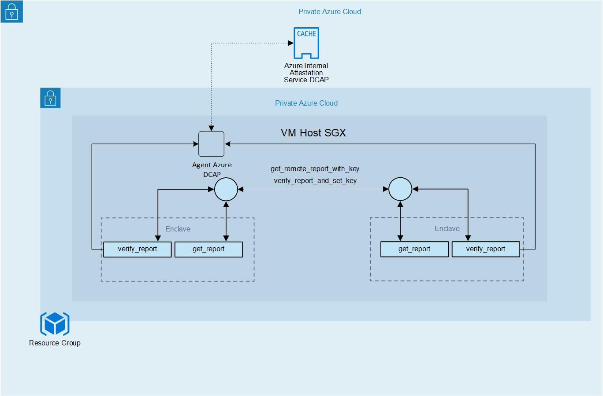

# Remote Attestation with local attestation

The host process is what drives the enclave app. It is responsible for managing the lifetime of the enclave and invoking enclave ECALLs but should be considered an untrusted component that is never allowed to handle plaintext secrets intended for the enclave.



## Build and run

You must have CMake and protobuf installed.
Then install gRPC following the guide here https://github.com/grpc/grpc/blob/v1.27.0/BUILDING.md
Last tested version with this sample is 1.27

### CMake

Requirements:
- Requirements from [OpenEnclave](https://github.com/openenclave/openenclave/tree/0.8.2)

Instructions:
```bash
cd remote_client_server
mkdir build && cd build
cmake ..
make run
```

