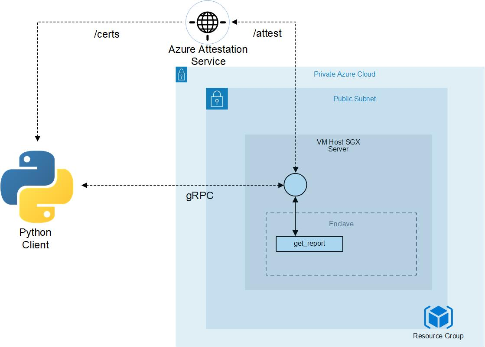

# One Enclave Attestation

The server host process is what drives the enclave app. It is responsible for managing the lifetime of the enclave and invoking enclave ECALLs but should be considered an untrusted component that is never allowed to handle plaintext secrets intended for the enclave.



## Azure Attestation Service configuration

Once your Azure Attestation Service (AAS) has been provisioned, you will need to configure Azure Active Directory (AAD) to access it.

The program does a HTTPS request to AAD to get a token to authenticate to AAS.

Complete the AAD credentials and AAS endpoint to your service in `server/host.cpp`:
```
aad_info_t aad_info{
    "CLIENT_ID",
    "CLIENT_SECRET",
    "TENANT_ID",
    "AAS_URL"
};
```

## Build and run

You must have CMake and protobuf installed.\
Then install gRPC following the guide here https://github.com/grpc/grpc/blob/v1.27.2/BUILDING.md\
Last tested version with this sample is 1.27.2\
Follow [AZURE_CONF_COMP_VM.md](../AZURE_CONF_COMP_VM.md) instructions to setup the environment successfully.

### CMake

Requirements:
- Requirements from [OpenEnclave](https://github.com/openenclave/openenclave/tree/0.8.2)
- virtualenv (or equivalent)
- Python3
- pip3
- `sudo apt-get install libcurl4-openssl-dev`

For server:
```bash
cd one_enclave
mkdir build && cd build
cmake ..
make run
```

For client:
```bash
cd one_enclave
cd client
./setup.sh
python3 client.py
```
Note: setup.sh will `source activate` to make changes to environment.\
And make sure to have started the server before running the client.
